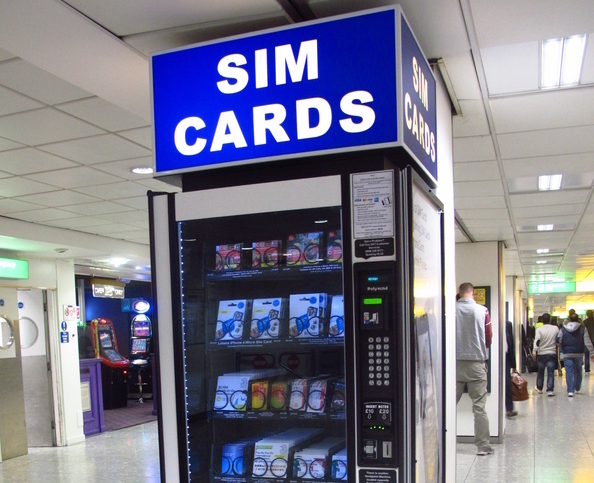

London is an amazing city, but like any big city it can be difficult for newcomers. Here are a few tips I picked up on my trip to London, England.

## London Skyline
Want to get a great view of the London skyline? Check out these spots:
* **London Eye** - I would suggest booking online because you need to pick a time for arrival. It provides a great 360 degree view of central London. I recommend going near the end of the day so you can see the sun set.
* **Sky Garden** - An Uber driver gave me a tip that Sky Garden is a great way to see London. It is free but you need to book way ahead of time.
* **St Paul's Cathedral** -  This was my favourite view. You need to climb a lot of stairs to get to the top, but the view is worth it.

{: .center-block :}

## Buy Football (Soccer) tickets early
I wanted to experience a Football game. I figured I could buy some tickets last minute because there are so many games and so many seats. It turns out if you want to get a fair price, you need to buy your tickets early. In the end it was well worth the experience. One issue I ran into was that the underground was closed for two hours after the game for security reasons, so I ended up taking an expensive Uber back to my hotel.

{: .center-block :}

## Getting around London
If you try to walk everywhere you are going to have a bad time. For example it takes an hour to walk from Big Ben to the Tower of London. The best way to get around is using buses and the underground. Here are a few tips:
* Get an Oyster card. They may seem a little pricey but it is much less expensive than paying for each trip. They allow you to go on the buses, subways (underground), trains, and some boats. A big confusion I had was what zones I should buy for. If you are touring around London you should just need Zones 1 - 3.
* Use a map app. I used google maps and my friend used apple maps. Surprisingly apple maps was better because it tells you which direction you need to go on the underground instead of just the stops. I also hear an app called [City Mapper](https://citymapper.com/london) is the best for navigating the tubes and buses of London.
* Avoid mass transit during rush hour.
* It is okay to take an Uber or a Taxi when you are in a pinch. The prices are surprisingly reasonable.
* When you are crossing the street, cars will only stop for you on cross walks (zebra crossings), and red lights.

{: .center-block :}

## Staying for more than a few days? Get a pay as you go sim card
Trying to find wifi so you can map your way to your next stop or lookup a good place to eat is time consuming. I picked up a 10GB of data pay as you go sim card for 25 pounds and it made the trip so much easier. I recommend you do the same.

{: .center-block :}

## Conclusion
I hope these tips help you enjoy London as much as I enjoyed it. If you have any extra tips or questions please post them in the comments.