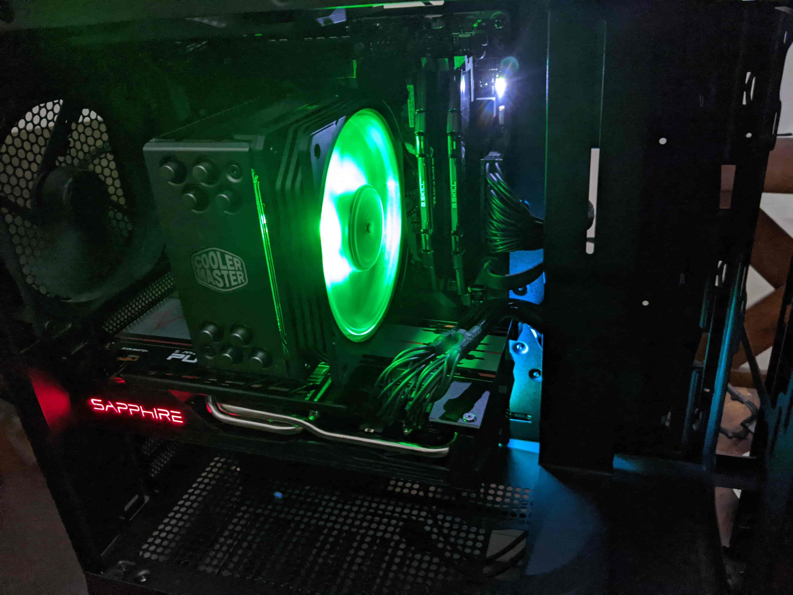

Hardware along with the "ops" side of software development has always been a weakness. 
Building a computer is almost a rite of passage for a software developer. 
Embarrassingly I've never built a PC from scratch before, but that is about to change. This is my story.

## Picking Parts

My budget was around $1500 CAD. I used a build suggested by Paul's Hardware with a few modifications. 
Here is the [link to the video](https://youtu.be/gPbUlyK0ncA).

Here are the parts I ended up ordering:
 * [My Build](https://pcpartpicker.com/user/Jimeh87/saved/D3RYgs)
 * Tool kit for computer assembly that turned out to be completely unnecessary
 
## All the parts are here!
 
{: .center-block :}
 
At this point I had watched several videos on assembling PC's while I waited for the parts to arrive. This should take me **an hour**.
 
{: .center-block :}

## Motherboard, CPU, CPU Fan, and Memory installed

{: .center-block :}

This was a struggle! It started with the CPU. I aligned it perfectly with the little triangle, but it wouldn't go in. 
Several youtube videos later, I noticed that I actually didn't align it perfect. Once I lined it up, it slid in easily.

The next adventure was with the CPU fan. There is a custom back plate? there are different configurations for AMD and Intel?
I eventually found an amazing old fellow who [explained everything](https://youtu.be/rJqYeIW9f5c). Praise him!
Did I end up not putting enough thermal paste and then put way to much? Obviously yes.

Surprisingly the memory installation went smoothly. I will always look back fondly on this step.

## Case, Hard-drive, Power Supply, Graphics Card

{: .center-block :}

A couple google searches and some youtube videos later and I was able to figure out how to take the glass casing off.
Installing the motherboard was tricky. The space was pretty tight so I ended up taking off the back fan.
Next I hooked up all the fans to the motherboard. Once I figured out that you can plug a 3 pin fan to a 4 pin slot, it went well.
Then I plugged in the rest of the random stuff coming from the case. It was difficult finding where to plug everything in.

This case has a spot on the back to install SSDs which was really simple.
{: .center-block :}
 
The power supply hookup was a little tricky. I had trouble hooking up the CPU power because I had to mash two four pin connectors into an eight pin.
 
The graphics card installation went really well. I'm amazed how huge it is.

## The moment of truth

{: .center-block :}
 
It's working! Thank the computer gods! If there were any issues I definitely would not have been able to diagnose it.
 
## The final setup
 
I have a sit stand desk so I mounted it under my desk. Looks great!

{: .center-block :}

## Final thoughts

The assembly process took about 6 hours. If I were to do it again with a different build, I think it would take about two hours.
There was such a large learning curve for each step that all the youtube videos in the world could not have prepared me for. 
I also think I should have purchased a bigger hard-drive. Overall this was a great learning experience. I will never buy a pre-built
computer again.