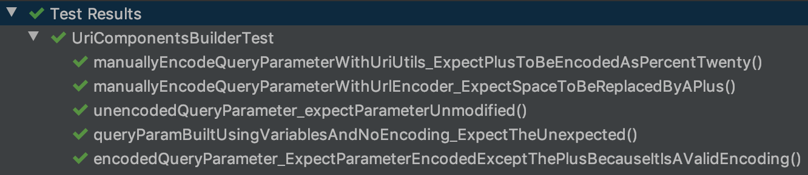

Spring's UriComponentsBuilder encoding is annoyingly inconsistent. In particular how it sometimes encodes "+".
You see "+" is a valid encoding, so if I ask for a url to be encoded, it can be unclear if "+" should or not.

### Let's look at how some classes encode urls


#### How does `java.net.URLEncoder` do it?

It encodes `+` to `%2B` and it encodes the `" "` to `+`

#### How does `org.springframework.web.util.UriUtils` do it?

It encodes `+` to `%2B` and it encodes the `" "` to `%20`. This seems like the most consistent way to me.

#### How does `org.springframework.web.util.UriComponentsBuilder` do it?

By default it does not encode the `+` and encodes the `" "` to `%20`. Great, three ways to encode. If you use variables
in your query parameters it will encode the `+` to `%2B` for the variable.

### Why is `UriComponentsBuilder` inconsistent?

Before Spring 5 `UriComponentsBuilder` used to encode `+`. They changed that in Spring 5 to comply with `RFC 3986`.
Unsurprisingly this messed up some apps relying on that encoding. [Long story](https://github.com/spring-projects/spring-framework/issues/21399) short,
they "compromised" by allowing variables use a "stricter" encoding which includes the `+`.

### My problem with the whole thing

When developers use `UriComponentsBuilder` they aren't using the variables functionality unless they want to inject parameters after they generate it.
By making variables encode differently then a query param that was most likely filled in by a java variable anyway is very unexpected.
The inconsistency really shows how divided the Spring community is over encoding a simple `+`.

### `UriComponentsBuilder` encoding tests

```java
package com.jimrennie.uricomonentbuilder;

import org.junit.jupiter.api.Test;
import org.springframework.web.util.UriComponentsBuilder;
import org.springframework.web.util.UriUtils;

import java.net.URLEncoder;
import java.nio.charset.StandardCharsets;

import static org.junit.jupiter.api.Assertions.assertEquals;

class UriComponentsBuilderQueryParamEncodingTest {

	private static final String PARAMETER = "a+b&c d";

	@Test
	void unencodedQueryParameter_expectParameterUnmodified() {
		String uri = UriComponentsBuilder.fromPath("https://blog.jimrennie.com/api")
				.queryParam("foo", PARAMETER)
				.build(false)
				.toUri()
				.toString();

		// Wait did UriComponentsBuilder just encode my space?
		assertEquals("https://blog.jimrennie.com/api?foo=a+b&c%20d", uri);
	}

	@Test
	void encodedQueryParameter_ExpectParameterEncodedExceptThePlusBecauseItIsAValidEncoding() {
		String uri = UriComponentsBuilder.fromHttpUrl("https://blog.jimrennie.com/api")
				.queryParam("foo", PARAMETER)
				.encode()
				.build(false)
				.toUri()
				.toString();

		// space can be encoded to + so it isn't "re-encoded". Super annoying.
		assertEquals("https://blog.jimrennie.com/api?foo=a+b%26c%20d", uri);
	}

	@Test
	void manuallyEncodeQueryParameterWithUrlEncoder_ExpectSpaceToBeReplacedByAPlus() {
		String uri = UriComponentsBuilder.fromHttpUrl("https://blog.jimrennie.com/api")
				.queryParam("foo", URLEncoder.encode(PARAMETER, StandardCharsets.UTF_8))
				.build(true)
				.toUri()
				.toString();

		assertEquals("https://blog.jimrennie.com/api?foo=a%2Bb%26c+d", uri);
	}

	@Test // This is the safest way to encode a query parameter as of today IMO
	void manuallyEncodeQueryParameterWithUriUtils_ExpectPlusToBeEncodedAsPercentTwenty() {
		String uri = UriComponentsBuilder.fromHttpUrl("https://blog.jimrennie.com/api")
				.queryParam("foo", UriUtils.encode(PARAMETER, StandardCharsets.UTF_8))
				.build(true)
				.toUri()
				.toString();
		
		assertEquals("https://blog.jimrennie.com/api?foo=a%2Bb%26c%20d", uri);
	}

	@Test
	void queryParamBuiltUsingVariablesAndNoEncoding_ExpectTheUnexpected() {
		String uri = UriComponentsBuilder.fromHttpUrl("https://blog.jimrennie.com/api")
				.queryParam("foo", "{var}")
				.build(PARAMETER) // Returns URI instead of UriComponents
				.toString();

		// Wait + is encoded properly now???
		assertEquals("https://blog.jimrennie.com/api?foo=a%2Bb%26c%20d", uri);
	}

}

```

{: .center-block :}

`</rant>`
